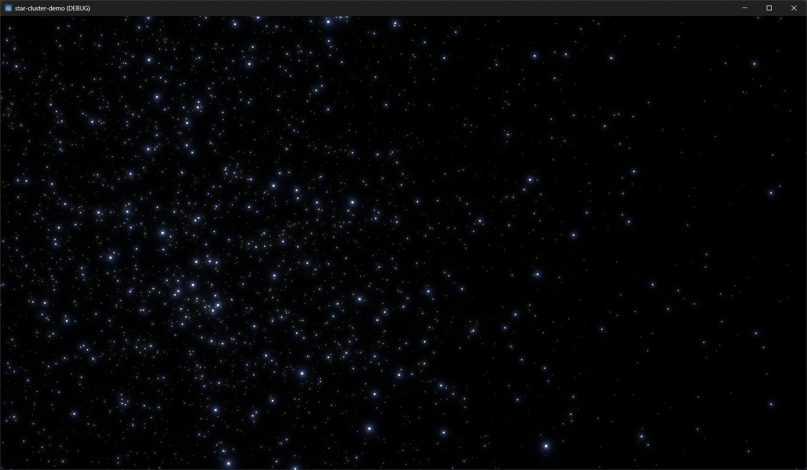
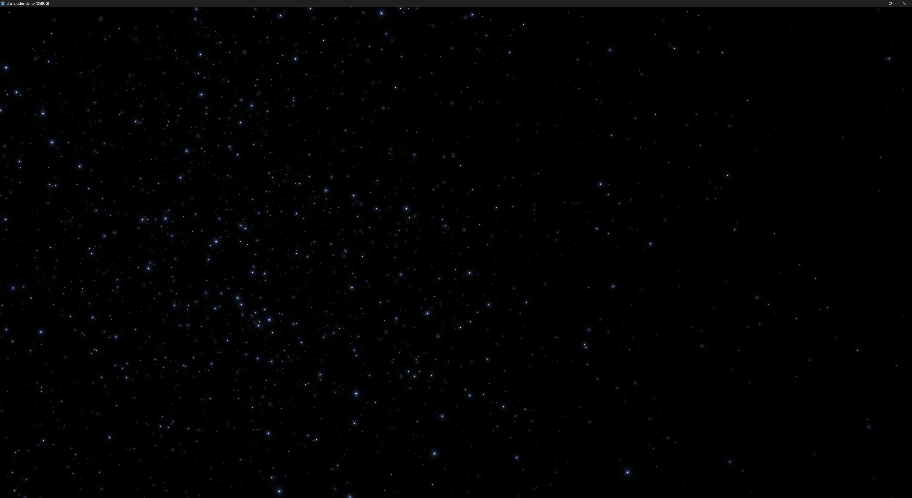
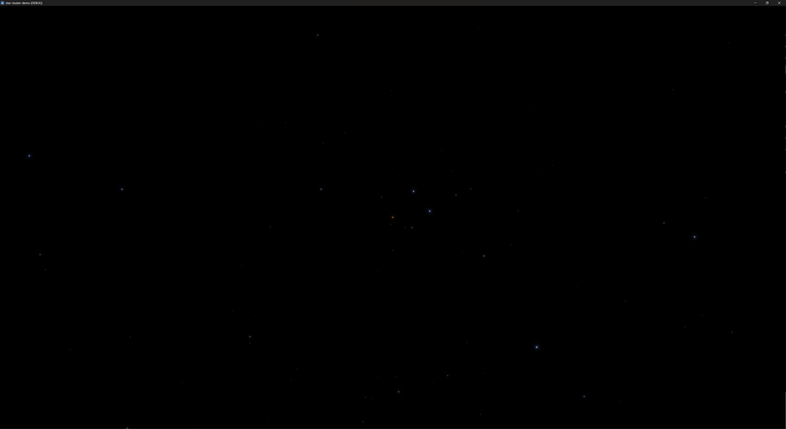
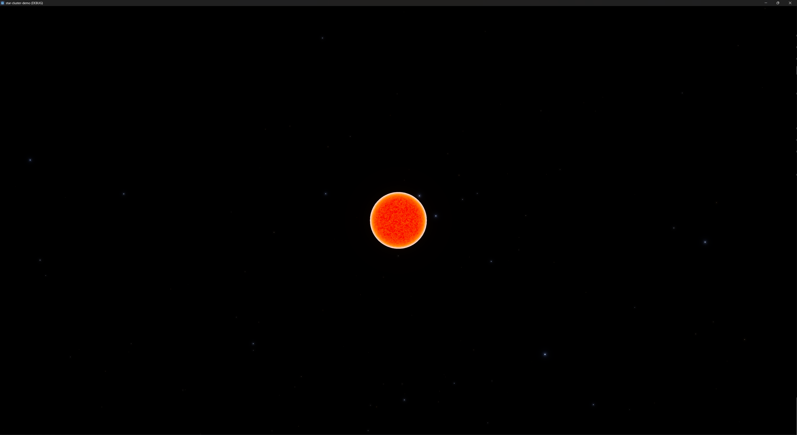

This is part of an experiment I did in 2023 with using semi-realistic cosmic
data in Godot Engine.

It features an extension written in Rust with
[gdext](https://github.com/godot-rust/gdext), random star placement in a cluster
using a normal distribution, a Kroupa-like IMF for mass values, and
blackbody-like colors.

It also features an attempt at
[emulated double precision](https://blog.cyclemap.link/2011-06-09-glsl-part2-emu/)
in the shader that renders the stars. The experiment was partially successful:
as the sky/starfield camera gets very, very close to a star (rendered as point
mesh in a multimesh), the star visibly wiggles just before vanishing due to near
clipping. The POV must get much closer before the sphere mesh of the star is
large enough to be seen.

To improve the effect, I think an additional layer should be responsible for
intermediate distances. It would functionally overlap with the far plane of the
primary camera and the near plane of the starfield camera. Practically, it could
be another render layer like the starfield. It could also be system of scaling,
billboarded sprites that render just inside of the primary camera's far plane
(which is similar to how stars currently work in this demo).

## Building

This will only work on Windows. Add more platforms in rust.gdextension. Build the Rust library first before opening the project in Godot.

## Controls

Press 0 to move at 3 million times the speed of light (default), and press 1-5 to fly to a random star.

## Screenshots

Approaching a red star, still rendered by the starfield only:

Getting close to a red star and the sphere mesh is visible:

